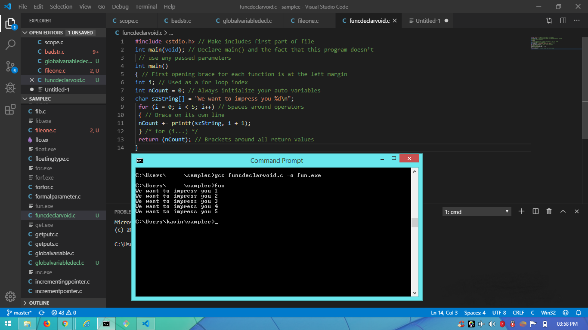

# ADVANCED C

## PART I- Honing Your C Skills

### CHAPTER I- The C Philosophy

The first C languuage was developed by Dennis Ritchie at Bell Laboratories in 1972 and ran on a DEC PDP-11.

The __ANSI__ standard for C, which replaced the standard writted by _Kernighan and Ritchie_ in 1978.

Here __ANSI__ stands for American National Standard Institute(ANSI). It produces standards that help keep each of the compilers working in the same manner.

#### Power of C

Most of C's power comes from these attributes:

* C can address and manipulate memory by direct address

* C has a powerful library of functions
  
#### Conditions:

* If the compiler does extend the ANSI compiler minimum limits and you use the extensions, you can be sure that when your program is compiled with another compiler, it will either not compile correctly or not execute correctly.
  
* Don't use all of the ANSI keywords are in lowercase as identifiers in program.Generally the compilers 'complines' when incorrectly use any reserved keyword.
  
### A Programming Style

1. Each tab is indented four characters.

2. Lines should be a maximum of 80 characters if at all possible.
   
3. Comments can use either the __ANSI__ standard /* comment */ or the newer //single line comment.

4. When variables are defined or declared, only one variable is allowed per definition or declaration.
   
5. All functions are prototyped, either in the header include file, or if there is none at the top of the file.
   
6. All data objects use Hungarian notation and are mixed case.
   
7.  All function names are mmixed case and should be descriptive of what the function does. If the return is not clear, use Hungarian notation for the function name.
   
8.  Opening and closing braces are on their own lines, aligned in the same column.
   
9.  Comments are just notes to yourself (and perhaps others)remaining you of what you did. 

10. Use blank lines wherever neccessary to make the code readable.
    
11. Use the variables i,j,k,l,m and n as for() loop indexes, and use them in order._Avoid using these variables for scratch variables._
    
12. Avoid "cute" code.
    
13. Use parentheses liberally.
    
14. Use the new _style_ function headers.
    
### Hungarian notation:

*_Hungarian notation_ prefixes a variable name with a letter or letters to tell the programmer what data type the variable contains.

*_Hungarian notation_ helps to prevent assigning the wrong data type to a variable, and helps you understand why you are using a particular data object.

### Function declaration:

* When you are writing a function, you must have a function declaration.

__Example1:__

int Myfunction(int n, char a[], char chMode)

__Example2:__

### Recommendation to order C source files:

1. Use a one-line file description with the filename
   
2. Add _#include_ statement
   
3. Folllowing information usually is included with a typical source file:

** PROJECT: The project’s name goes here.

** TITLE: The FILE’S title (not the project title).

** FUNCTION: What the function(s) in this file does.

** More than one line if necessary.

** INPUTS: What generally is passed to the functions.

** OUTPUTS: What the functions return.

** RETURNS: Some functions don’t return normally; say so if necessary.

** WRITTEN: When the file was created.

** CALLS: Significant calls to other parts of program.

** CALLED BY: Who (generally) calls these functions.

** AUTHOR: Your name.

** NOTES: Modifications, special considerations, and so on.

** COPYRIGHT 1992: By whomever. All rights reserved. All wrongs deserved.

4. After the program header, put the definitions and declarations used in this file.
   
5. List the file's functions.
   
### Memory Models

*_using a memory model larger than necessary isn’t always a serious problem._