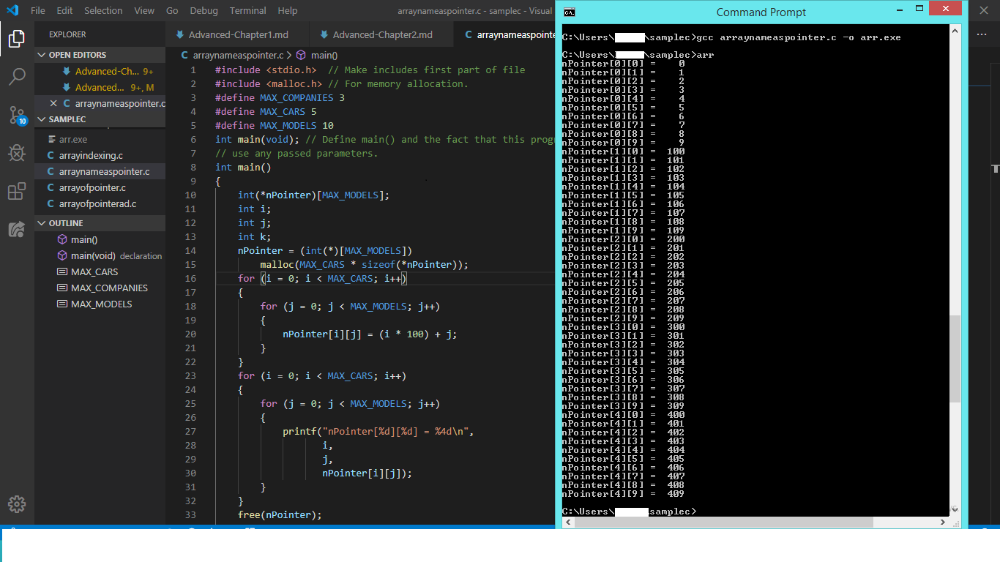

# Advanced C

## CHAPTER 2 DATA TYPES, CONSTANTS, VARIABLES AND ARRAYS

### Data Types:

* The C language supports a number of data types. 

### C's Data Types:

#### Type- Size- Description:

* char- 1- byte Used for characters or integer variables.
* int- 2 or 4- bytes Used for integer values.
* float- 4- bytes Floating-point numbers.
* double- 8- bytes Floating-point numbers.
* long- 4- bytes integer value. 
* short- 2- bytes integer value.
* unsigned int hold values between 0 and 65,535. (It holds only positive numbers)
* signed int hold values between -32,768 and 32,767.
  
#### Hint:
* A number of useful identifiers are defined in the limits.h header file in ANSI C.
* Other identifiers generally are defined in float.h
  
### Constants:
All homes are buildings, but not all buildings are homes. All literals are _constants_, but_not all constants are literals_.

__Example:2.1__

## Definitions Versus Declaration:
* When a data object is declared, only its attributes are made known to the compiler. When an object is defined, not only are its attributes made known, but also the object is created. For a variable, memory is allocated to hold it; for a function, its code is compiled into an object module.
* __DEFINITION = DECLARATION + SPACE RESERVATION__
  
##### Following are examples of declarations:
* extern int a;//Declaring a variable without definting
* struct_tag Example (int a;int b;};//Declaring a struct
* int myfunc{int a, int b};//Declaring a function
##### Following are examples of definitions:
* int a;
* int b=0;
* int myfunc{int a, int b}{return a+b;}
* struct_tag Example example;

### Variables:
* Variable data object can be modified.
* Variables can be any of data type like int, float, char, structure or union.

### Why we need __Iniitialization__???

* Uninitialized variables will take some garbage value already available at their memory location.
* So, initialization is good program practice
  
### Initialization of Variables:

* Global variables are initialized automatically by the system when you define them.

* Local variables aren't initialized by system, it should initialized by ourself.

### Hint:

__Data Type__    -   __Initial Default Value__

    int          -           0

    char         -          '\0'

    float        -           0

    double       -           0

    pointer      -          NULL

#### Scope Rules:

   * It is a region of the program where a defined variable can have its existence and beyond that variable it cannot be accessed.

#### Example:2.2

#### Life span:

   * Life span indicates how long the variable or function going to be here.

#### Example:2.3

#### Type Casting:

* It used to converting a variable of one data type into another data type.

#### Example:2.4

#### Arrays:

### Need of Array :

* To store a collection of data which possess same data type we need an Array.

### Hint:

* Must declare the size of an array to ensure that have not exceed the bounds of the array.

### How to declare an Arrays:

datatype arrayName [ arraySize ];

### How to  Access an Array Elements:

 * Declare an Array
 * Initialize the elements of an array
 * Access elements of an array by calling with arrayName
 * Each successive array element is accesssed by incrementing the pointers by the size of the array and the array elements.

## Concepts of Array:

* C supports multi dimentional array

    ### Declaration of multidimensional array:

        datatype name[size1][size2]...[sizeN];

#### Example:2.5

### Example:2.6

### Array Name as pointers:

#### Example:2.7

Here, memory dynamically allocated with the help of malloc header file

### Character Array:

* A String is defined as an array of type char.
* When a double quoted string constant is specified, the compiler provides a terminating NULL.
    Example: char f[40]= "This is a good time to start work. \0"
    Here, the string is terminted with two NULLS.

### Array of Pointers:

#### Example:2.8

