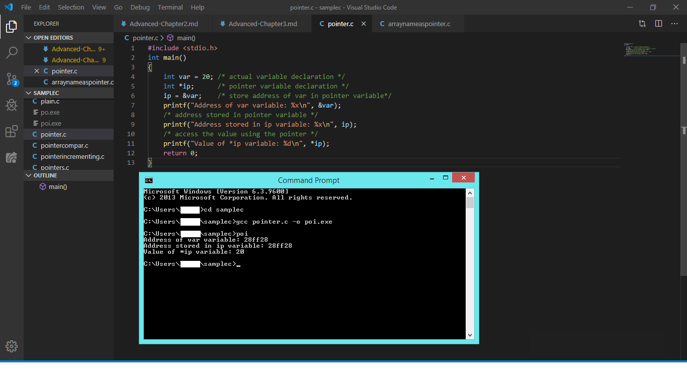
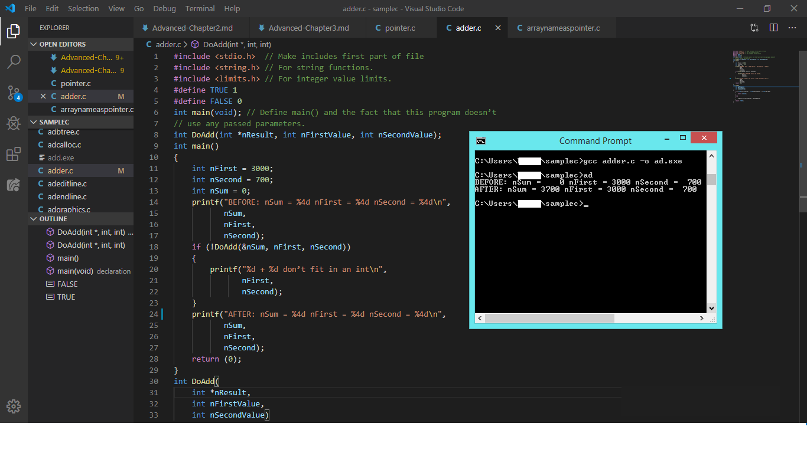
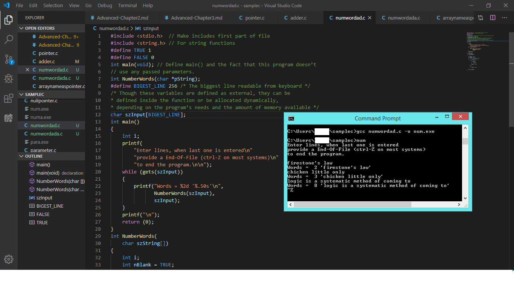
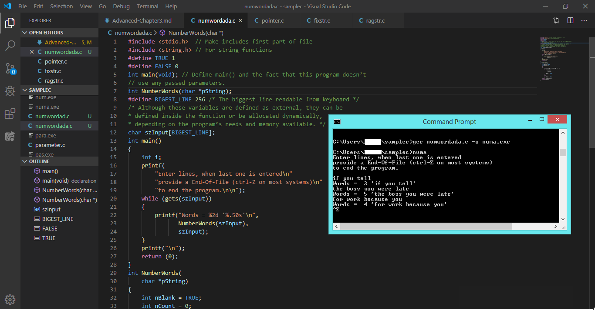
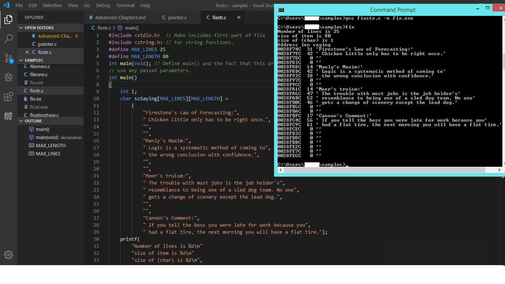
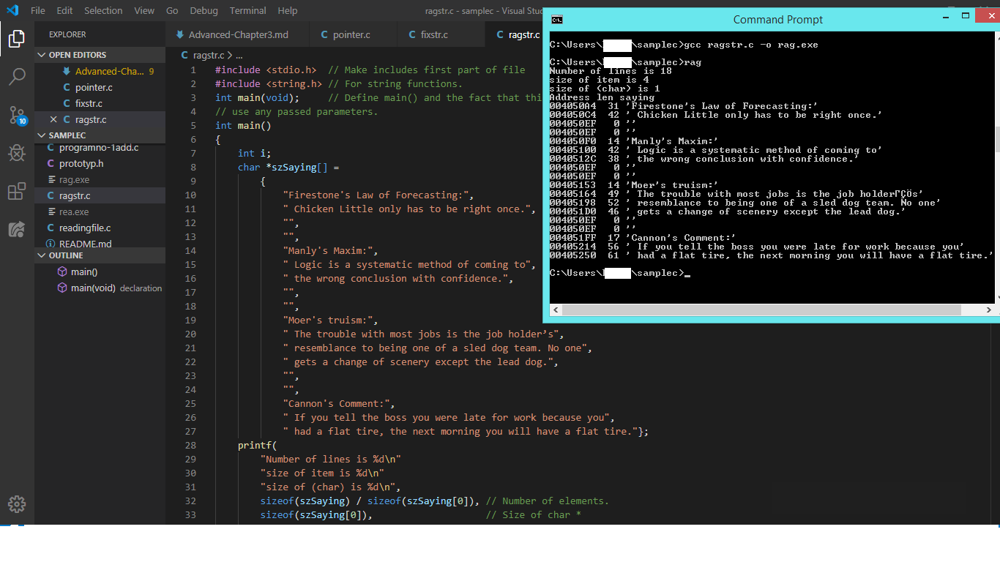

# Advanced C 

## Chapter 3. Pointers and Indirection

### Pointers

* Pointer is a variable that holds the address of another variable.* But pointer cannot hold the address of constant except string constant.
* & represents the address of operaator.

### Indirection

* Obtaining the value of the memory object to which the pointer is pointing.

#### Example Program 3.1:Pointer

#### Example Program 3.2:Adder

### String

* C stores string as array of type char.

### Example Program 3.3:Number of Word in a string

### Example Program 3.4:Number of word in a string with indirection

* Protecting strings in memory is essential otherwise the program crashed.

#### Example Program 3.5:Fixstring

* Ragged right string method wastes no spaces.Thus, this strings are difficult to modify.

#### Example Program 3.6:Ragged String

