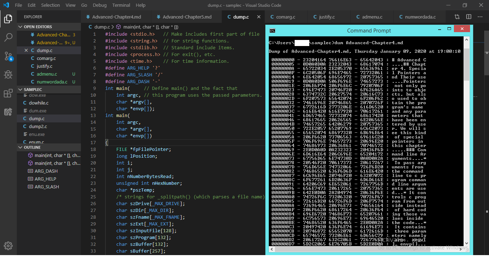

# Advanced C

## Chapter 5. Decimal, Binary, Hex and Octal

* __Decimal__ (base 10) number system required for programmers. Because, this number system is based on counting on fingures. So, we use in everyday life.

* __Binary__ (base 2) number system required for the computer. Because, the CPU understands its base directly and the computers have no problems counting math, storing and performing I/O using binary numbers.

* __Hexadecimal__ (base 16) number system used by programmers in writing software. It compromise between binary and decimal. Some programmers can do hex addition and subtration without help of calculator.

* __Octal__ (base 8) number system is used in number of DEC computers.

* __Dump__ program that reads files of any length and lists their contents in an easy-to-use format.
  
##### Example Program 5.1: dump.c

* __Bit field__ used to store much information by using individual bits.