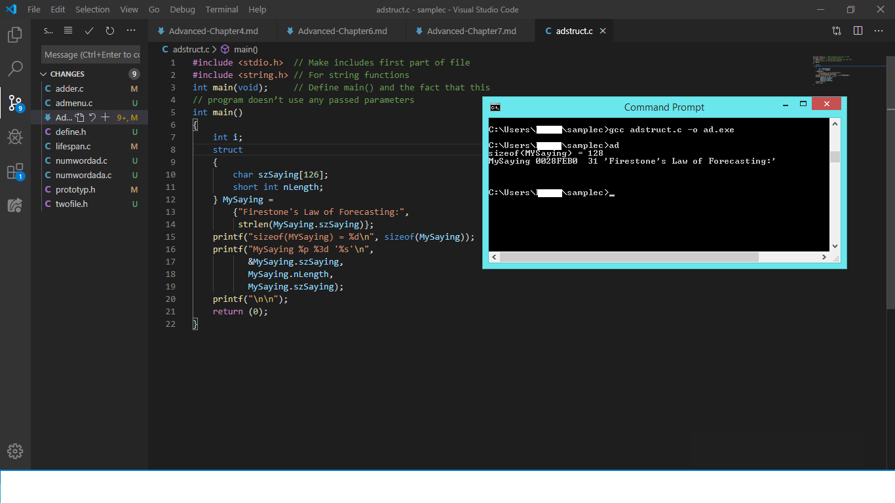
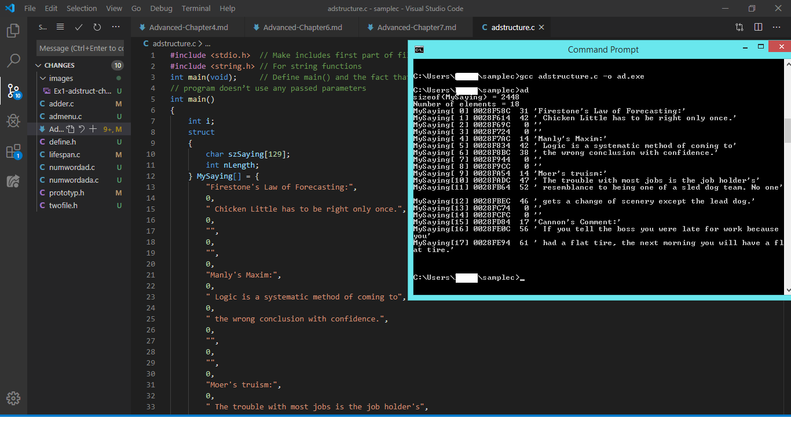
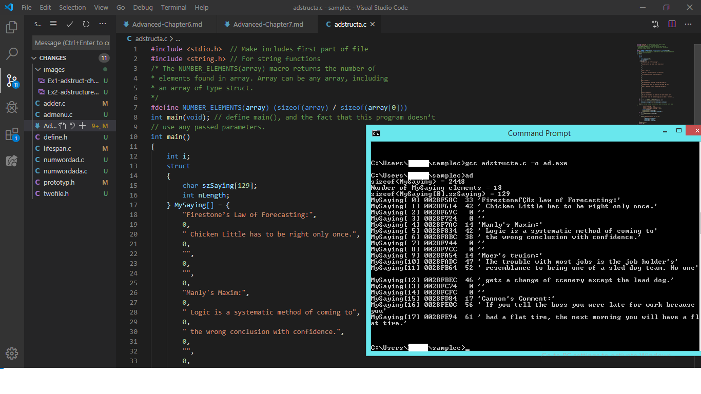
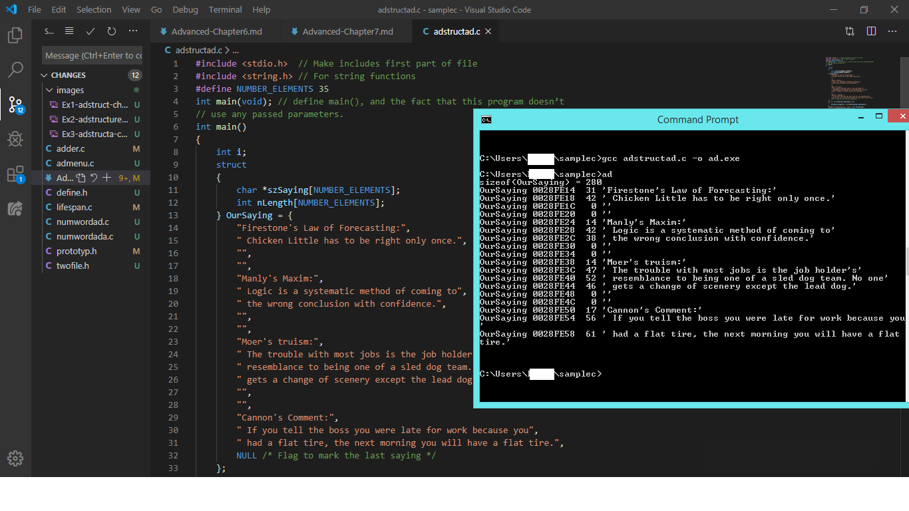
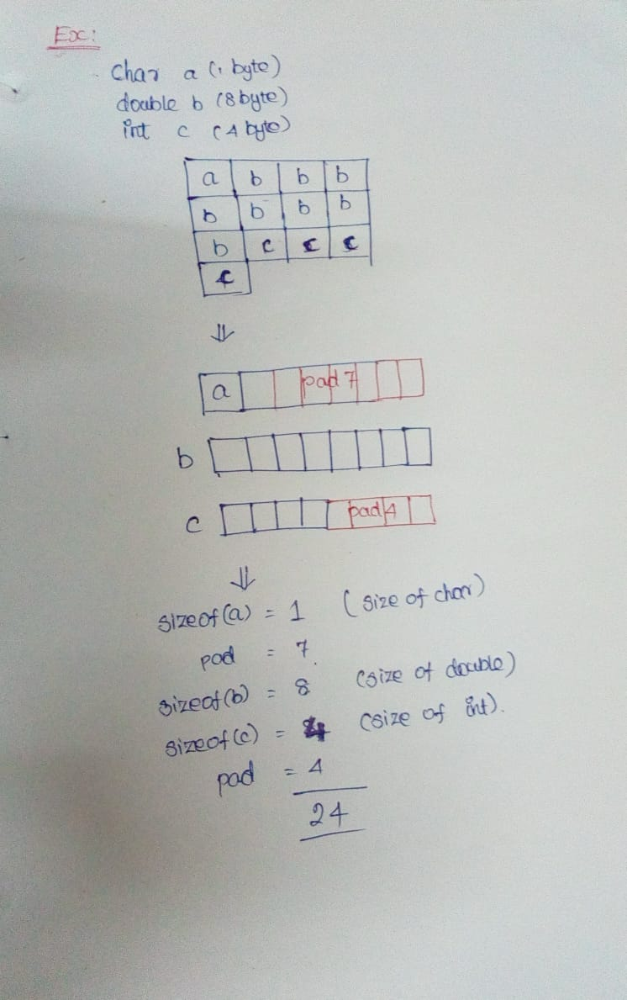
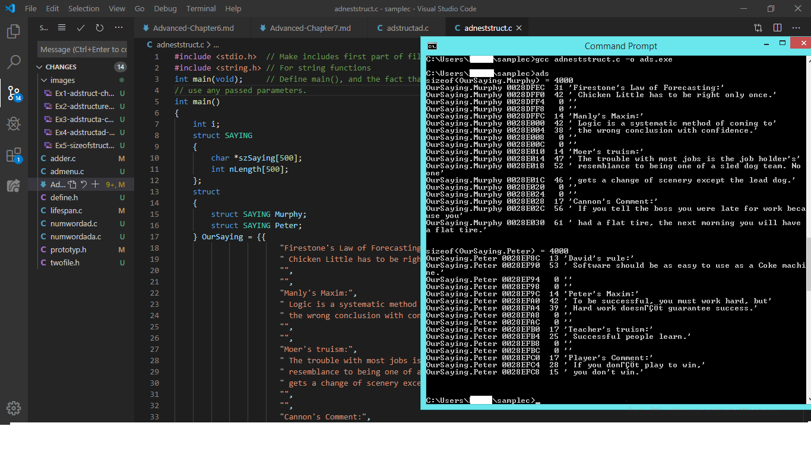
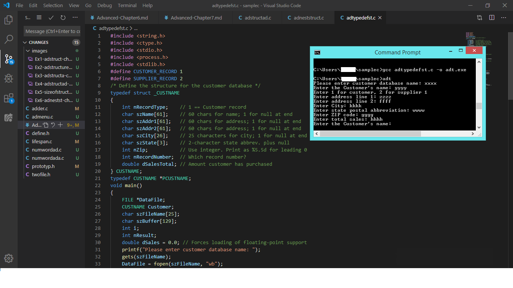
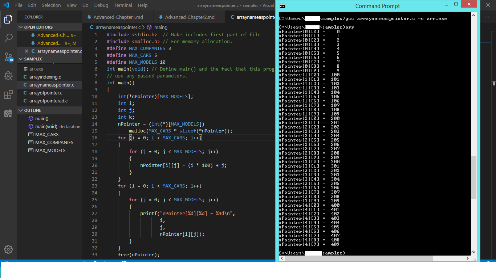
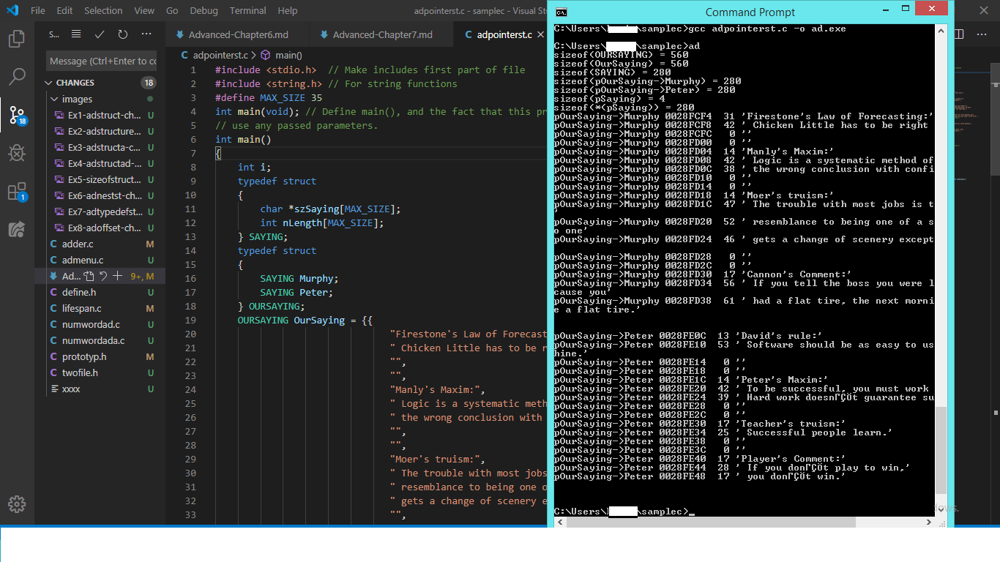

# Advanced C Programming

## Part II Managing Data in C

### Chapter 7. C Structures

* To store the collection of heterogenous data seperately.

#### Syntax:

struct tag_name //Here, tag_name used to define the Structure { //This brace signals the compiler that the next lines are member definitions.
    type member_name;
    type member_name;
    type member_name;
}structure_name = // This name used to declare the structure
 initializers_values";// Used to refer the data objects
* The definition of structure provides the data object that can be referenced by structure name with initializers_values.So, the entire data object is refered by the structure_name.
* If, both the tag_name and structure_name isn't provided, a compile time error will result. 
* Structure name can be used as passed parameter to a function. Function can return the structure.
* Two structures assigned by using assignment statement.

#### Example Program 7.1:Simple structure Program

#### Example Program 7.2:Array of structure 

* Here, the initializers_values used to refer the data object
* If the number of elements isn't specified in initializers_values, following code is used to find the number:
  
    _nNumberofMembers=(sizeof(structure_name) / sizeof(structure_name[0]))_

#### Example Program 7.3:Using nNumberofMembers formula

* If a specified string is constant, the advanced program is used to save the space and it doesn't allocate additional space. 

#### Example Program 7.4:Effective use of memory space

* Here, the size of specified structure is 280 byte whereas the same structure accupied 2448 byte in the previous program. Because, here pointer is used. In these preceding examples th size of the structure is calculated by size of data types and padding bytes.

#### Illustration 7.5:Graphical explanation

* To avoid this padding, we should declare the data types either in ascending order or descending order.

#### Nested Structure:

* It is used to have a members of structure be structures themselves.
* According to the ANSI C standard, maximum limit of nesting is 35.

#### Example Program 7.6:Nested Structure

#### Bit fields in Structure:

* It used to store the value of defined variables in a bit level. Hence it reduce the storage space of the variable. 

For example,

struct {
unsigned int bIsValid;
unsigned int bIsFullSize;
unsigned int bIsColor;
unsigned int bIsOpen;
unsigned int bIsSquare;
unsigned int bIsSoft;
unsigned int bIsLong;
unsigned int bIsWide;
unsigned int bIsBoxed;
unsigned int bIsWindowed;
} Status;

* This structure requires 20 bytes.But using bit field it requires only 2 bytes(i.e)

struct {
unsigned int bIsValid:1;
unsigned int bIsFullSize:1;
unsigned int bIsColor:1;
unsigned int bIsOpen:1;
unsigned int bIsSquare:1;
unsigned int bIsSoft:1;
unsigned int bIsLong:1;
unsigned int bIsWide:1;
unsigned int bIsBoxed:1;
unsigned int bIsWindowed:1;
} Status;

* We can define int x:5 to be a 5-bit int and short z:12 to be a 12-bit short. We cannot determine the address of the bit field variable. This is the major limitation of bit field. If we use the address of opertor, the compile time error will result. An anontymous bit field will force the next bit-field to be aligned to a word boundary or something similar.

#### Typedef Keyword:

* It used to define a type of variable. It also used to create any data type from simple variables, arrays, structures or unions.

#### Example Program 7.7: Typedef with structure:

* Here, we can create many structure using the name CUSTNAME. memset() function used to clear the structure's content and we must pass the address of the structure and sizeof the structure.

#### offsetof() macro:

* It used to determine the offset of a member in a structure.
* This is the quickest method to determine how many bytes written in the file.

#### Example Program 7.8: offsetof() macro in structure

#### Pointers in structure

#### Example Program 7.9: Pointers in structure

* It is more efficient to pass pointer to a structure compared to pass a entire structure.
* To access the structure arrow operator(->) is used.

#### Union:

* It used to store the all members in same block and changes of one member will change the entire members too.