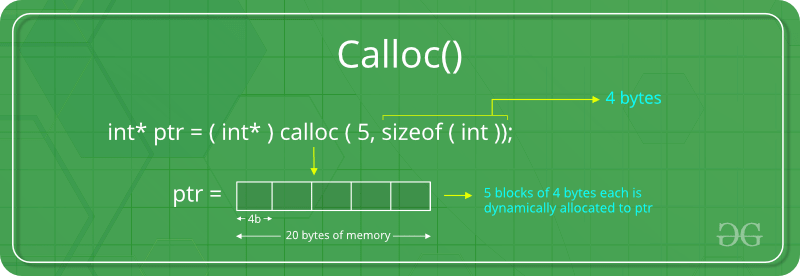
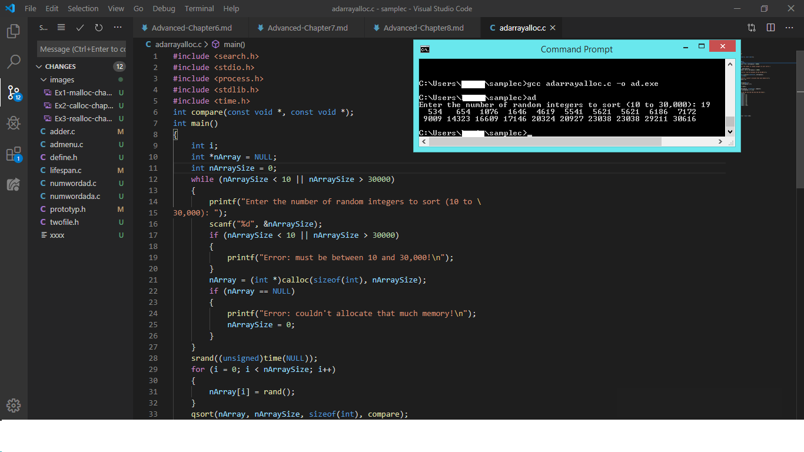

# Advanced C Programming
## Chapter 8. Dynamic Memory Allocation

There are four function namely malloc(), realloc(), calloc() and free() used for memory allocation and these functions are offered by ANSI C.

### * malloc() function:

Memory allocation(malloc) is used to dynamically allocate a single large block of memory with the specified size. 

malloc() doesn't initialize memory. It returns pointer.

#### Function                  -         Description

void * malloc( size_t size );        The ANSI C standard memory allocation function.

void _ _based( void ) *_bmalloc ( _ _segment seg, size_t size );     Does based memory allocation.The memory is allocated from the segment you specify.

void _ _far *_fmalloc( size_tsize ); Allocates a block of memory outside the default data segment, returning a far pointer. This function is called by malloc() when the large or compact memory model is specified.

void _ _near *_nmalloc ( size_t size );              Allocates a block of memory insidethe default data segment, returning a near pointer. This function called by malloc() when the small or medium memory model is specified.
             
* We should allocate memory between 25 or 50 bytes and 32,767 bytes.

#### Explanation 8.1: malloc() function

.png)

### * calloc() function:

Contiguous allocation(calloc) is used to dynamically allocate the specified number of blocks of memory of the specified type.

It initializes all bits to zero.

#### Function                            -       Description

void * calloc( size_t num, size_t size );        The ANSI C standard memory allocation function.

void _ _based( void ) *_bcalloc ( _ _segment seg, size_t num, size_t size );     Does based memory allocation. You provide the segment that the dat will be allocated from.

void _ _far *_fcalloc( size_t num, size_tsize ); Allocates a block of memory outside the default data segment, returning a far pointer. This function is called by calloc() when the large or compact memory model is specified.

void _ _near *_ncalloc ( size_t num, size_t size );              Allocates a block of memory inside the default data segment, returning a near pointer. This function called by malloc() when the small or medium memory model is specified.

#### Explanation 8.2: calloc() function

#### free() function:

It used to reset the pointers into null, when the block of memory freed

for (j = 0; j < i; j++)
{
free(nPointer[j]);
nPointer[j] = NULL;
}

Here, this loop used to reset the pointers. 

#### realloc() function:

* When calloc() allocating all available free memory for the program, it wastes a lot of memory.

* The best solution to overcome this issue is to call realloc() function

* The realloc() function copies the content of the original block of memory into new block, then it frees the original block. Hence the work is minimized. 
     
#### Explanation 8.3: realloc() function:

.png)

#### Allocating Array:

It used to dynamically allocte the array at runtime with calloc() call function.

#### Example Program 8.4: Allocating Array:

#### Hint:

The pointer(near and far pointer) size affects the size of the executable program and the performance of the program.