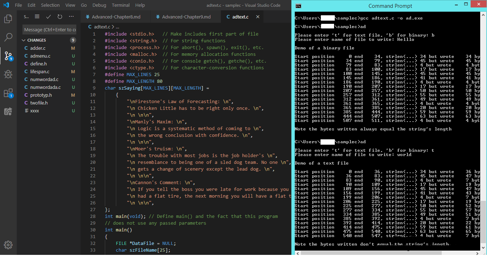
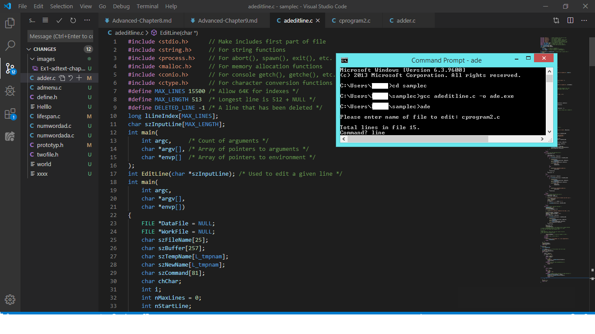

# Advanced C Programming
## Chapter 9. Disk Files and Other IO

* ANSI offers collection of file IO functions.
* We can write a file in unformatted manner and our program can write a file in formatted manner.
* Here, unformatted refers to machine readable manner and formatted file refers to the people readable manner.
* Eight character is the format for the disk filename and three characters is the format for the extension.
* If a file consist of only text, it may contain EOF(End of File) file.
* All files also have attributes, as follows:
        Normal-> No special attributes are set for the file.
        Directory-> The file is a directory. The directory attribute can be used with the hidden attribute.
        Hidden-> The file’s name is not displayed when you issue a DIR command without the /A:H option.
        System-> The file is used only by the operating system. Generally, only the two files belonging to the operating system have the system attribute.
        Read-> only The file can be only read, not written or deleted.
        Archive-> The file has not been backed up since it was last changed. BACKUP and XCOPY can use and change the archive attribute.
* Except read attribute, others must be set using DOS ATTRIB command. 
* When a file is opened, the program typically must specify the filename and the mode: read, write, or both read and write.
* Identifier returned by opened file used to call the read and write function.
* If the program has finished with the file, the file should be closed or the file should be temporarly deleted.
* ftell() and fgetpos() functions used to return the correct position of the data object.

#### Example Program 9.1: Textfile with newline conversions

Here, in binary mode the number of bytes depends only on the number of charcter not on the number of new line character. But whereas, the number of bytes depends on the number of new line character in text mode.

#### Example Program 9.2: Line Editing

Here, the sscanf() function used to allow us to read the formatted data from a string rather than standard input.

#### Stream File and Default file Handles:

Stream file can be opened with anyone of these three functions:

* fopen() Opens the specified file with the specified mode

* freopen() Closes the file specified, then opens a new file as specified

* fdopen() Opens a duplicate stream file for an already open low-level file

#### Function - Description

_fsopen() -> Microsoft’s shared file open.

clearerr() C-> lears the current error condition flags.

fclose() -> Closes the specified file.

fcloseall() -> Closes all open stream files.

fdopen() -> Opens a low-level file as a stream file.

feof() -> Checks for end-of-file in a stream file.

ferror() -> Tests for a read or write error.

fflush() -> Flushes pending I/O for a file.

fgetc() -> Gets a character from a stream file.

fgetchar() -> Gets the next character from a file.

fgetpos() -> Gets a file’s current position, for use by fsetpos().

fgets() -> Gets a string from the specified file.

fileno() -> Returns the low-level file handle for a stream file.

flushall() -> Flushes pending I/O from all opened files.

fopen() -> Opens a stream file.

fputc() -> Writes a character to the specified file.

fputchar() -> Writes a character to the specified file.

fputs() -> Writes the buffer to the stream file.

fread() -> Reads from the specified stream file.

freopen() -> Reopens the file.

fscanf() -> Does a formatted read from a stream file.

fseek() -> Sets the file’s current position as specified.

fsetpos() -> Sets the file to the position obtained by fgetpos().

ftell() -> Gets the file’s current position.

fwrite() -> Writes to a specified file.

getc() -> Gets a character.

getchar() -> Gets a character from stdin.

gets() -> Gets a string from stdin.

getw() -> Gets an integer from the specified file.

printf() -> Does a formatted write to stdout.

putc() -> Writes a character to a stream file.

putchar() -> Writes a character to stdout.

puts() -> Writes a buffer to stdout.

putw() -> Writes an integer value to a file.

rewind() -> Sets the file’s current position to the beginning of the file.

rmtmp() -> Removes (deletes) temporary files opened with tmpfile().

scanf() -> Does a formatted read from stdin.

setbuf() -> Sets the stream file’s buffer.

setvbuf() -> Sets the stream file’s buffer (variable size buffer).

sprintf() -> Does a formatted write to a string.

sscanf() -> Reads formatted input from a string.

tempnam() -> Gets a temporary filename, allowing the specification of a different directory.

tmpfile() -> Opens a uniquely named temporary work file. When the file is closed or the program ends, the file is deleted.

tmpnam() -> Returns a unique name for use as a temporary filename.

ungetc() -> Puts back a character to a file opened in the read mode. The character put back does not need to be the same as the one read, but only one character can be put back at a time. Two successive calls to ungetc() without an intervening read will fail.

vfprintf() -> Does a formatted write to the specified file. The output is pointed to by a parameter-list pointer.

vprintf() -> Does a formatted write to stdout. The output is pointed to by a parameter-list pointer.

vsprintf() -> Does a formatted write to the specified string. Output is pointed to by a parameter-list pointer.

* The stdin file is opened by operating system and it is considered to be keyboard.
* getchar(), gets() and scanf() functions use stdin file.
* The stdout file also opened by operating system and it is considered to be keyboard.
* printf(), putchar(), puts() and vprintf() functions use stdout file.  
* The stderr() file used to display the error message on screen.
* The stdaux() file is the auxillary file and aux device is defined as main serial communication port.
* The stdprn() file used to write in system printer without explicitly open a file. 
* The capability to open, read, and write any data object is present in both low-level files and stream files
* Low-level functions do not to format data, read from a file, or write to a file.
* Console functions receive input from keyboard and write them on the VDU(Visual Disply Unit)
* The term console is a term used for the black window.
* The kbhit() function enables to poll the keyboard for a keypress. Example games and in real in time also.
* Direct port I/O can be dangerous because the program is interacting with the hardware at a basic level.
* inp(), inpw(), outp() and outpw() functions are examples of direct IO functions.
* The PC supports three printer ports. The addresses for the printer ports are in the BIOS data area, at segment 0040, as follows: 0040:0008 for LPT1, 0040:000A for LPT2, and 0040:000C for LPT3. Typical addresses for printer ports are 0x0378 or 0x03BC.
* The serial communication ports are more complex than the printer ports. Because, they need more intialization. Here, speed(baud rate) and format of the characters must be set.
* The UART (Universal Asynchronous Receiver/Transmitter) is the part of the communications port that converts a byte of data to a serial data stream. It has eight separate addresses.
* READCOMM.C pogram gets a character from the serial port, sends it back (echoes the character), and displays it on the terminal’s screen.