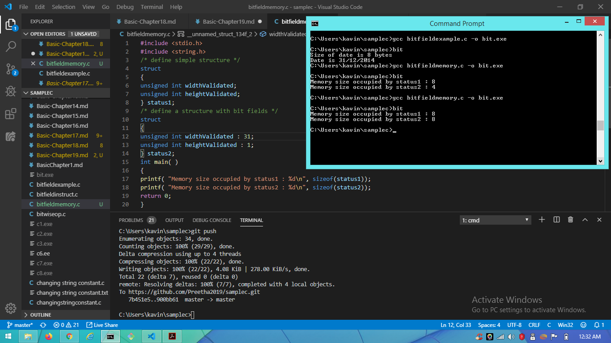

# Basic C Programmimg Tutorial

## Chapter 19. Bit Fields

    Bit field used to optimize the space

### Bit Field Declaration inside structure:

struct

{

type [member_name] : width ;

};

    __Example Program__

### Note:

    If the bit width exceeds the defined limit, it returns 0

    __Example Program__
    
(img src"https://photos.app.goo.gl/YFdhe6KAYPbk45Xq7")